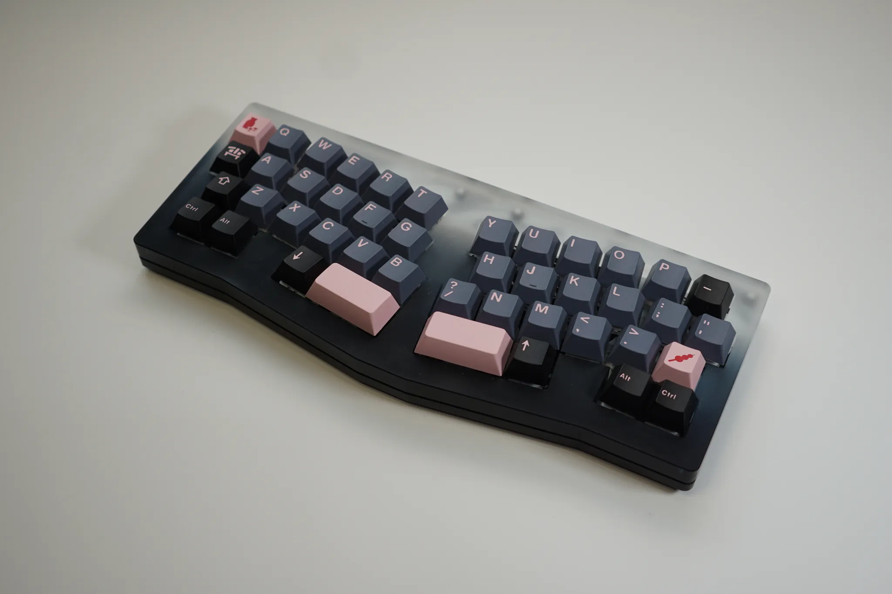

# Alix 40

*image provided by [kayso](https://www.instagram.com/kaysovt/)*.

## Description
Alix 40 is a 40% Alice keyboard. Alix uses a plateless assembly in an acrylic case. It implements shock-absorbers on the PCB for mounting. The top and bottom parts of the case are milled acrylic, and dip-dyed by hand by Toya Senryo in Asakusa, Tokyo.

Alix uses a 0° typing angle and has support for both Bluetooth wireless and wired usage.  

From the IC: "[Alix] is hand-crafted in Tokyo by local craftsmen and designed to be niche". A video of the creation process is available [here](https://www.youtube.com/watch?v=G36aYIesauE&t=167s).

The Alix40 Group Buy was limited to 100 units, and sold out in 16 hours. It was sold through the [Tokyo Keyboard website](https://shop.tokyokeyboard.com/).

Alix was available in two colorways:

Sunset             |  Ghost
:-------------------------:|:-------------------------:
  |  

## Layout

Two Layouts were available; 2x 1u on split space, or combined into 2u to replace it.

## Designer
- [TokyoKeyboard](https://tokyokeyboard.com/)

## Group Buy Information

- Date: 10th September, 2020 - 30th September, 2020
- Price: $560

## Media

| Platform | Builder  | Link                                         |
|----------|----------|----------------------------------------------|
| YouTube  | Alexotos | https://www.youtube.com/watch?v=tOMlXmVPats |
