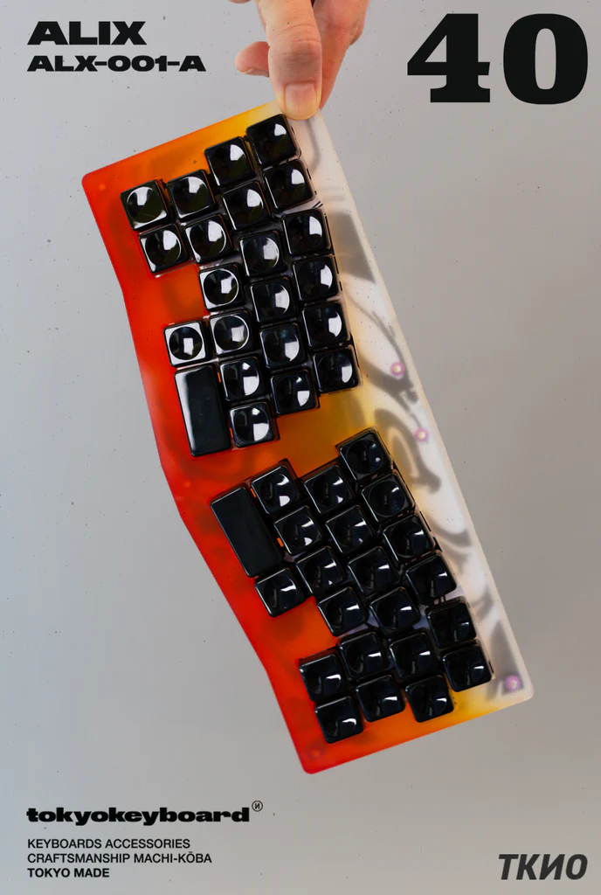

# Alix 40

## Description
Alix 40 is a 40% Alice keyboard. Alix uses a plateless assembly in an acrylic case. It implements shock-absorbers on the PCB for mounting.

From the IC: "[Alix] is hand-crafted in Tokyo by local craftsmen and designed to be niche".

Alix was available in two colorways:

Sunset             |  Ghost
:-------------------------:|:-------------------------:
  |  

## Layout

Two Layouts were available; 2x 1u on split space, or combined into 2u to replace it.

## Designer
- [TokyoKeyboard](https://tokyokeyboard.com/)

## Group Buy Information

- Date: ? - 30th September 202x
- Price: $560

## Media

| Platform | Builder  | Link                                         |
|----------|----------|----------------------------------------------|
| YouTube  | Alexotos | https://www.youtube.com/watch?v=tOMlXmVPats |
