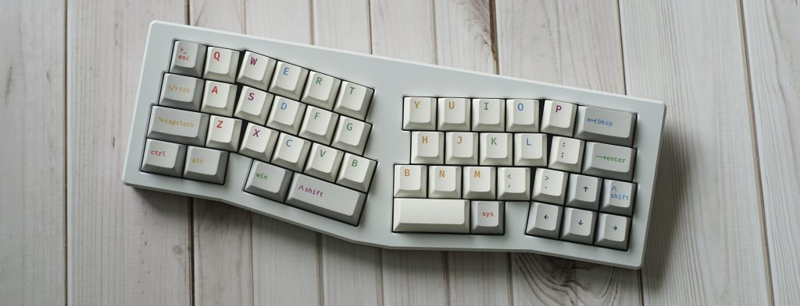
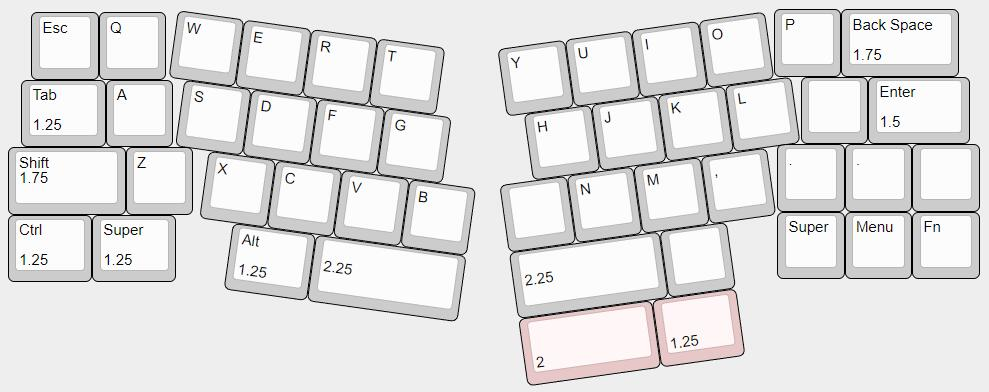

# Bolt

## Description
Bolt is a 40% Alice Keyboard created by Jacky at LazyDesigners. The original idea behind Bolt was for the designer to create a 40% ergonomic design for his friends. In 2020, five units were created with an acrylic case. Due to a large amount of interest a public group buy was held later that year in July 2020. In November, 2021 a public group buy was held.

The acrylic case for Bolt was open-sourced at the end of 2021, and is available [here](https://github.com/jackytrabbit/Bolt).

Bolt was originally hotswap and came with a stacked acrylic case, later an aluminum case was created which featured a stainless steel PVD weight. For the R1 group buy of the aluminum version of Bolt, (100?) slots were available which opened on December 13th, 2022. The second batch group buy happened in February 2023. The aluminum case implemented a top-mount construction.

## Layout

## Designer
 - [LazyDesigners](https://lazydesigners.cn/)
 - [LazyDesigners Discord Server](https://discord.gg/AV4qGSk)
 - [Jacky Li YouTube Channel](https://www.youtube.com/jackylijun)

## Group Buy Information
- Acrylic:
  - Date: July 15th, 2020
  - Price: ?
- Aluminum R1:
  - Date: 13th December, 2022 - ?
  - Price:
    - $260 for solder
    - $270 for hotswap
- Aluminum R2:
  - Date: - 11th March, 2023
