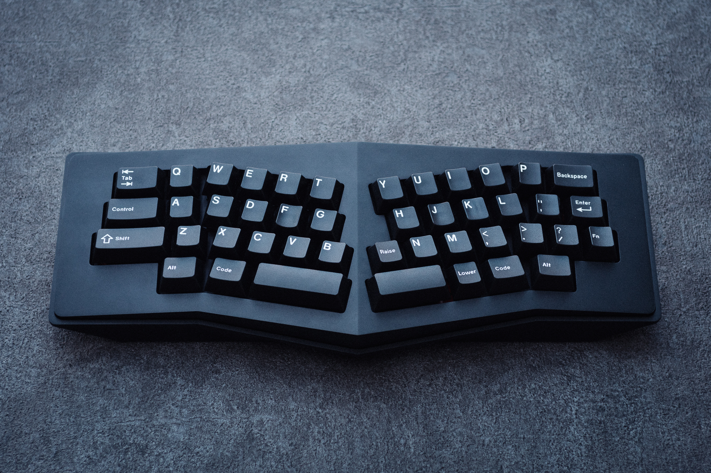
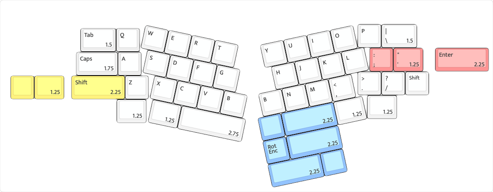

# Cisne

*cover image taken by Peppy*

## Description
Cisne utilizes a 5° tented top case, an 8° typing angle and a HHKB Alice-like layout. It implemented a magnetic top case for a screwless design. The Cisne came in a mirror-black finish, matte black and e-white options.

Cisne was originally called Suikalice in 2022, but the name was changed to Cisne shortly after.

R2 is currently in development, as of the time of writing (Jan 2025).

## Layout

## Designer
- Suika
- [Sonatina Discord](https://discord.com/invite/7ZaGRGwd56)

Note from the Designer?

## Group Buy Information
- A preorder was held for 100 units via the designers website, which was first come first serve.
- Preorder Date: ? - April 23rd, 2022.
- Price: $269
- R1 Group Buy Date:

## Media
| Platform | Builder  | Link                                         |
|----------|----------|----------------------------------------------|
| Youtube  | Therese Adoremos  | https://www.youtube.com/watch?v=idXufiNrNN0 |
