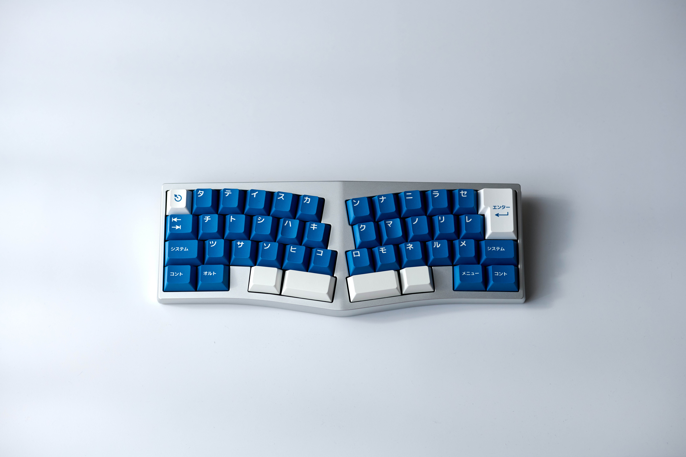
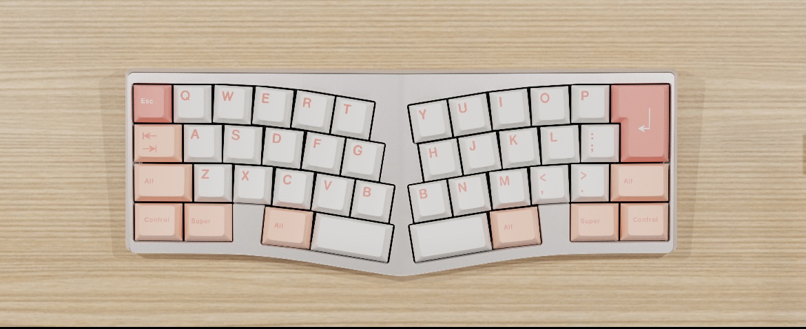
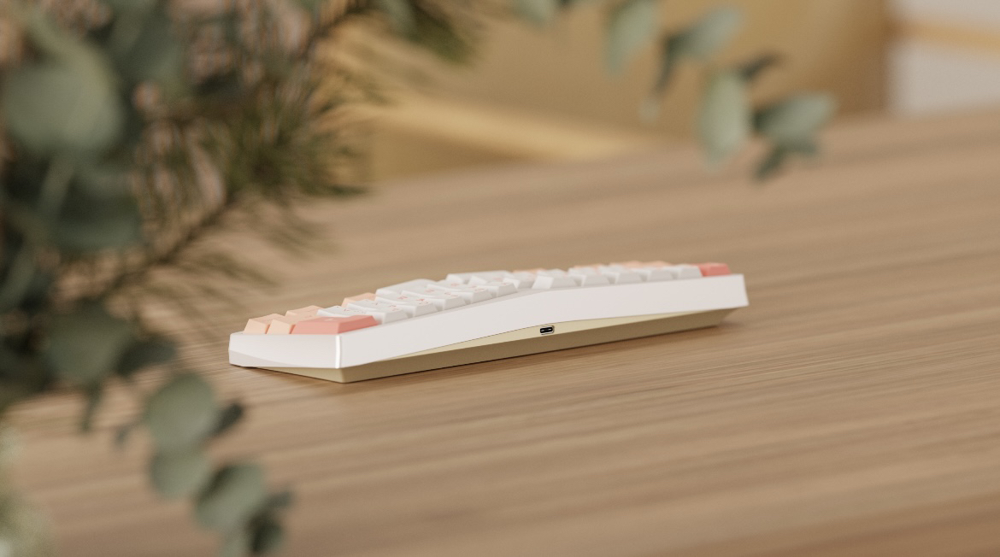
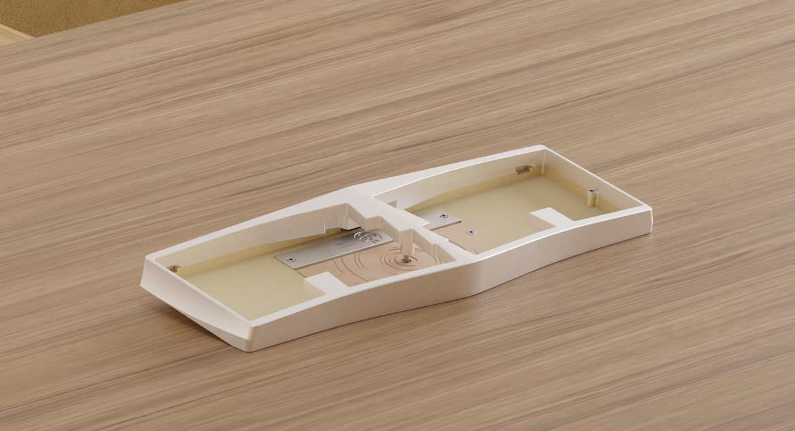

# Shizuku

*Image provided by NullPtr*

## Description
Shizuku is an alice-style 40% keyboard based on a 12.5u layout. It uses a top-mount design for the two halves, and is tented in the middle.

## Layout

//Todo

## Designer
- Mugitya / Maicha

## Group Buy Information
The Group Buy for Shizuku was held privately, and was available for owners of Chalice from the R1 Group Buy. No IC or traditional GB was held. Instead, participants were shown an image of the prototype/render and decided whether they wished to participate.

A total of 30 units were made.

- Available Options: The only available option at the time was a silver top and a brass bottom.
- Date: September 6th, 2023.
- Delivery: March 20th, 2024
- Price: ¥2999(RMB) / ~$410(USD)

Images that were shown to original buyers to gauge interest:

Image 1             |  Image 2             |  Image 3  
:-------------------------:|:-------------------------:|:-------------------------:
  |    | 
