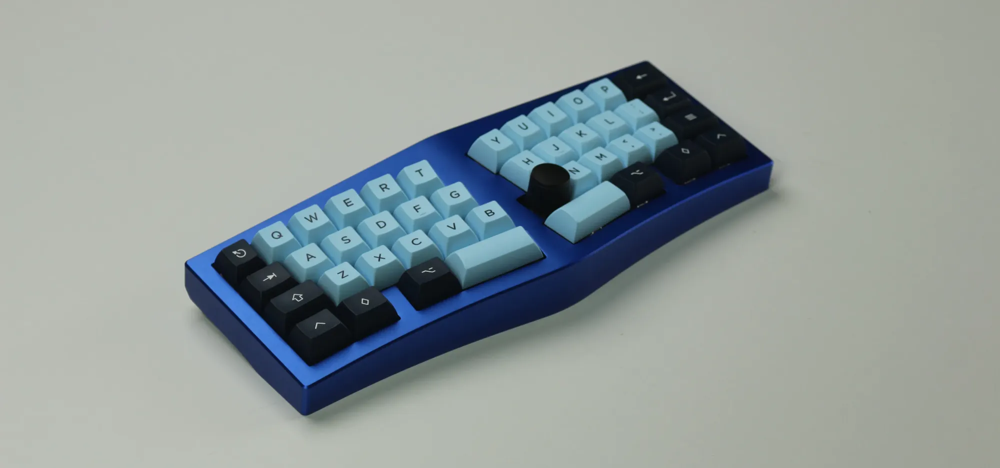
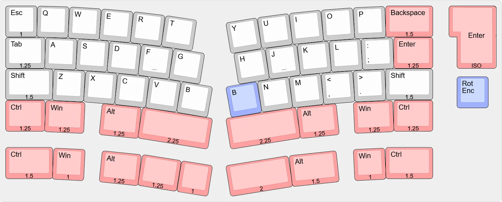

# Wellenphase

## Description
Wellenphase is an upcoming 40% Alice keyboard that utilizes a gasket mount. It features a 5° typing angle, a 5° tenting angle and a 10° split angle.

Additional information on Wellenphase can be [found here](https://gregarious-mall-392.notion.site/Wellenphase-1705a54918cf801faedce4f2693c4a9e). Development and Group Buy is being discussed in the 40% Discord server, under the *#wellenphase* channel.  

## Layout

## Designer
- Dino

## Group Buy Information
- TBD
