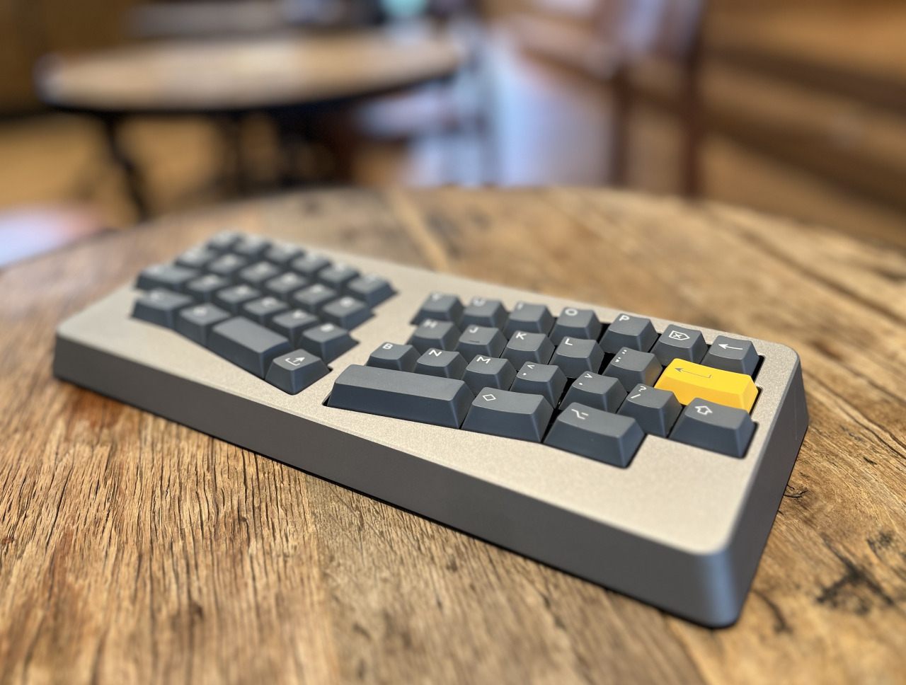
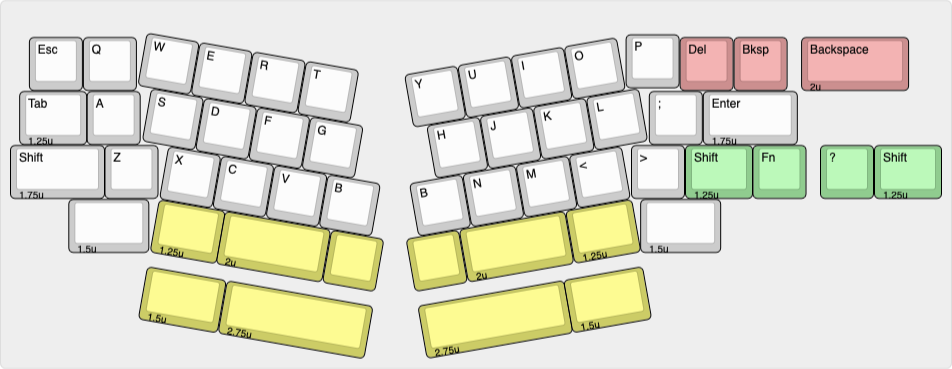

# Yak40

## Description
Yak40 is a hotswappable alice style 40%, utilizing a burger-mount/top-mount assembly. The case design is similar to that of Menhir and Hill40.
- Centered bottom row
- Alphas tilt: 10.0°
- Typing angle: 6.0°

The design is open-sourced, and available [here](https://github.com/kuriki-sasa/Yak40).

## Layout

## Designer
- [Kurikisasa](https://kuriya-keebs.com/)

*Note from the designer?*

## Group Buy Information
- Pre-Sale: A small number of units were sold originally at the first Keyboard Market in Tokyo, in March of 2024. Following that, an Interest Check was held in the 40% Discord Server, with interest warranting in-stock sales.
- In-Stock: The In-Stock sale began on November 5th, 2024, and is periodically restocked. The link for purchase is [here](https://kuriya-keebs.com/products/yak40-kit).
- Price: $280
