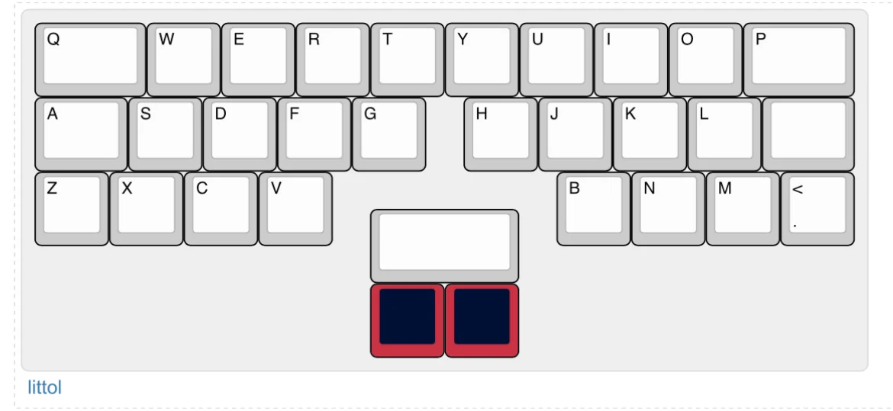

# Littol

*Image provided by [Ricky](https://www.instagram.com/enemyofshrimp)*

## Description
Littol is an 11u 30% katana stagger keyboard. It has a 4.3° typing angle with a hotswap RP2040 PCB.

Also, it's so l i t t o l.

## Layout

## Designer
- Obabo

## Group Buy Information
- Available at [Coffee Break Keyboards](https://www.cbkbd.com/product/littol)
- Price: $130
