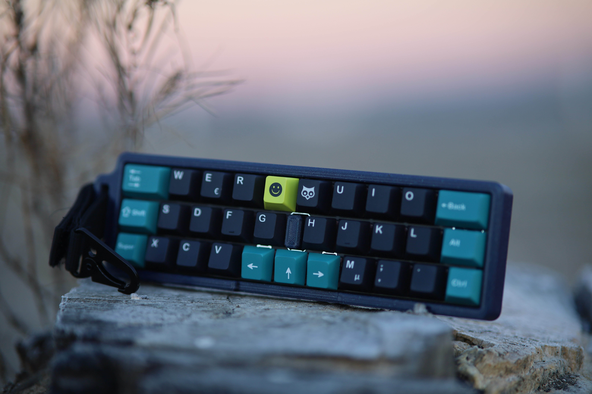
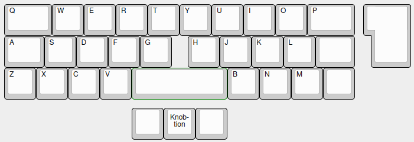

# Tsuru

*Image provided by [Seeb](https://github.com/SeebM), case design by [Krisenplan](https://www.instagram.com/krisenplan/)*

## Description
A 3 row, katana-staggered keyboard with ISO Enter compatibility.

A popular case was designed by [Krisenplan](https://www.instagram.com/krisenplan/), which included a strap and optional travel case. This case is available [here](https://www.printables.com/model/946165-tsuru-travel-keyboard-case?lang=de).

## Layout

## Designer
- [Kilipan](https://github.com/kilipan)

## Group Buy Information
- Date: ? - April 22nd, 2024
