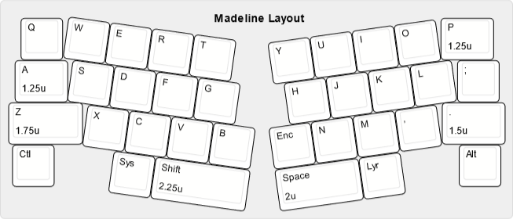

# Madeline

*Image provided by [Kibicrunk](https://www.instagram.com/willow.b.photography/)*

## Description
The Madeline is a premium 35% QAZ-like, alice-style, gasket mounted keyboard with encoder support and a brass weight.

The PCB is RP2040-based and connects via JST to a daughterboard. Encoder and switch footprints are supported on both 'b's (firmware only recognizes one encoder).

Madeline is based on the [Adalyn](https://github.com/MarvFPV/Adalyn).

## Layout

## Designer
- [RubyBuilds](https://shop.rubybuilds.com/)

## Group Buy Information
- Group Buy Date: February 1st - March 1st, extended to March 9th.
- Price: $375 - $442
- Extras went live on November 2, 2024
- Additional 4.7mm plates were also available
