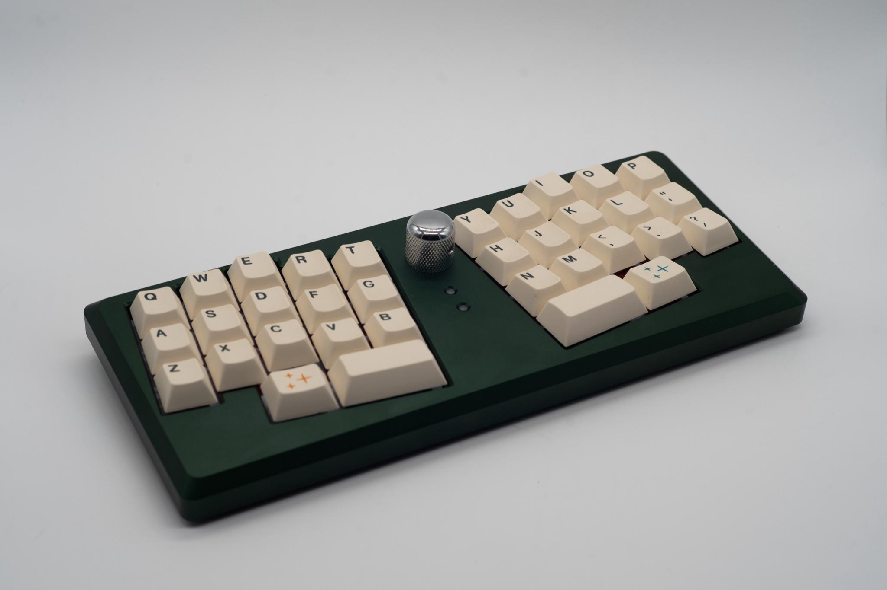
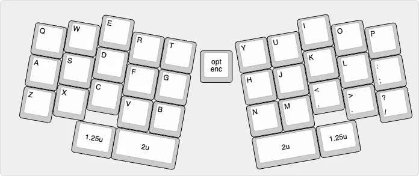

# Le Chiffre

## Description
Le Chiffre (ironically, "the number" in French)

Arguably the most iconic 30% keyboard. The purpose of Le Chiffre was to provide a platform for MX and Choc ergo (Alps support too!) in one package for when ones wrists need a break.

Le Chiffre is open-source and [available here](https://github.com/tominabox1/Le-Chiffre-Keyboard).

## Layout

## Designer
- [tominabox1](https://github.com/tominabox1)

## Group Buy Information
Available here:
- [US](https://www.jlw-kb.com/products/le-chiffre-plus-kit)
- [EU](https://keeb.supply/products/lechiffre-kit)
- [Open-Source](https://github.com/tominabox1/Le-Chiffre-Keyboard)
