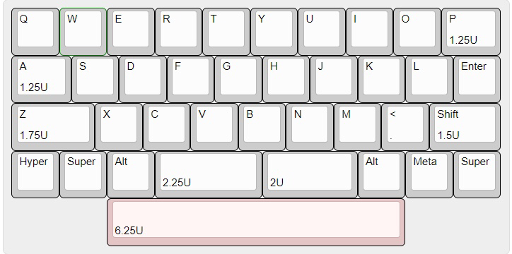

# Apricot

*Image provided by [Dakfu](https://www.instagram.com/dakfu/?hl=en)*.

## Description
Apricot is a qaz keyboard inspired by tominabox1’s QAZ design. Apricot comes in HHKB, WKL and regular layouts.

The R2 version of Apricot added a polycarbonate version, new color variants, the PCB was changed from pink to white but kept the pink hotswap sockets. No Ortho layout was available during this round of the group buy.

A popular configuration for owners of Apricot is a polycarbonate top, with an aluminum bottom, as seen in the cover image.

## Layout

## Designer
- [LazyDesigners](https://lazydesigners.cn/)

## Group Buy Information
- R1:
 - Extras Sale: 17th November, 2022
- R2:
  - Date: January 29th, 2023 - 14th February, 2023
  - Color Options:
    - E-Pink
    - E-Yellow
    - E-White
    - Anodized Purple
    - Polycarbonate
  - Pricing:
    - With solder PCB: $215
    - With hotswap PCB: $225
