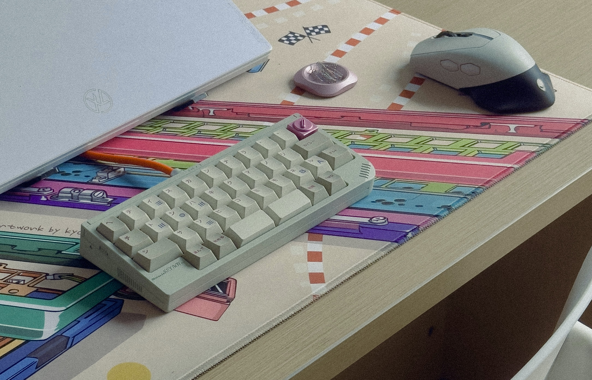

# GB34

*Image provided by [Galo](http://xhslink.com/a/e4KS2T3Bwuw4%EF%BC%8C%E5%A4%8D%E5%88%B6%E6%9C%AC%E6%9D%A1%E4%BF%A1%E6%81%AF%EF%BC%8C%E6%89%93%E5%BC%80%E3%80%90%E5%B0%8F%E7%BA%A2%E4%B9%A6%E3%80%91App%E6%9F%A5%E7%9C%8B%E7%B2%BE%E5%BD%A9%E5%86%85%E5%AE%B9%EF%BC%81).*

## Description
#34 is an 11u QAZ keyboard with wireless options. It was designed to match the original DMG GameBoy, and came in a series of colours to compliment this design feature. From the sales page: "*A retro-gaming inspired 40% design. Compact, classic, and full of fun.*"

## Layout
GB34 came with two options, either a traditional QAZ stagger or an Ortho layout.

## Designer
- Niuniu

## Group Buy Information
- Date: September 11th - October 7th, 2024
- Price: $164.99 - $184.99
- Link: https://en.zfrontier.com/products/pre-order-gb34-by-niuniu
