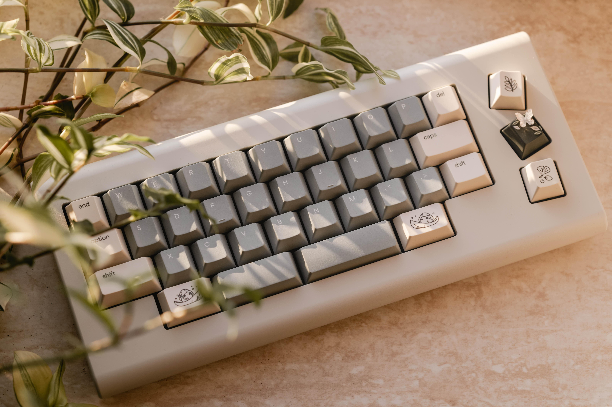
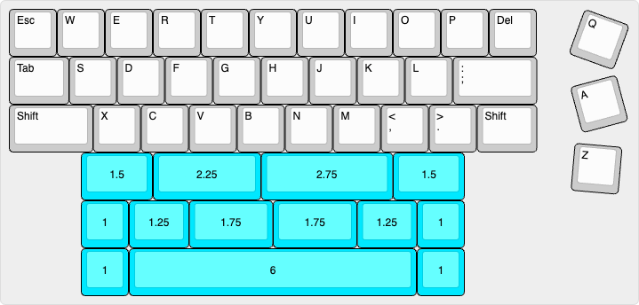

# Qazimodo

*Image provided by [ChelleKeebs](https://www.instagram.com/chellekeebs/)*

# Description
The keyboard that inspired comments like “This is a joke at best and mostly just waste” and “I get the feeling that a lot of you like the idea of mechanical keyboards more than you actually like mechanical keyboards”.

Inspired by the layouts of the QAZ and the Vault 35, Qazimodo is a top-mounted QAZ-ish keyboard with additional exploded Q, A, and Z keys. QAZ with a side of QAZ.

The keyboard uses a top-mount assembly, with a 3° typing angle. The kit comes with an aluminum case and hotswap PCB. The official website can be [found here](https://qazimodo.com/).

Instagram page with additional images can be [found here](https://www.instagram.com/qazimodo.kbd/).

## Layout

## Designer
- Scoot Broer

- Note from the designer: "*The Qazimodo layout was originally a joke for a friend who often comments that my Vault doesn’t have enough keys. Turns out people were into the silly layout and next thing I knew I was designing a case and ordering prototypes.*"

## Group Buy Information
- Dates: November 11th - November 25th 2024.
- Price: $200 - $250
- Link: https://quasikeys.com/products/qazimodo-group-buy
