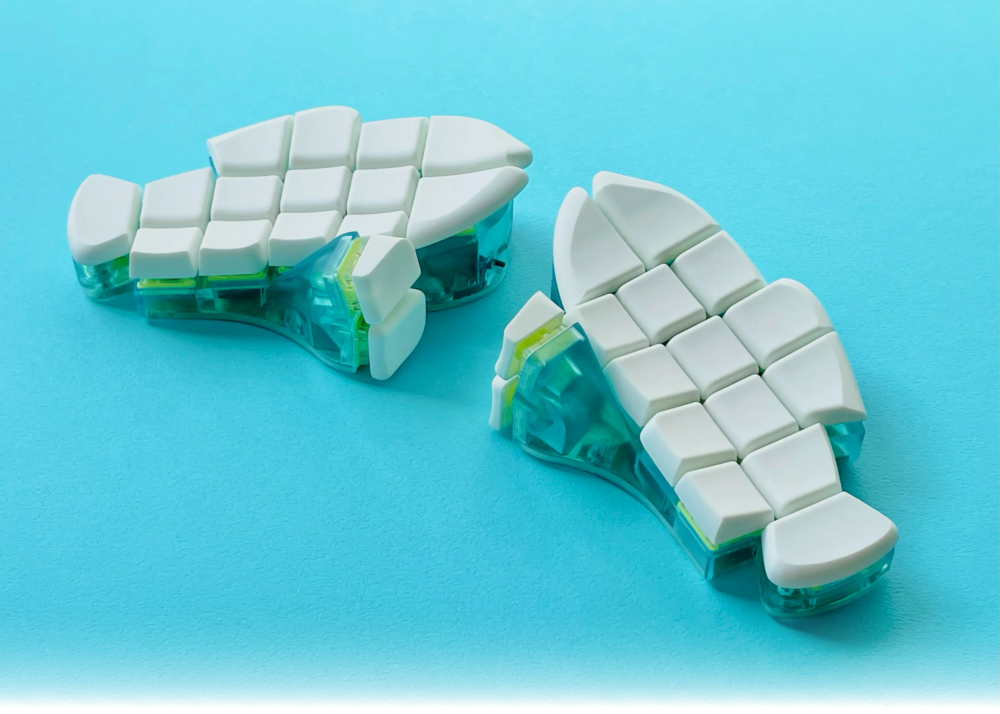
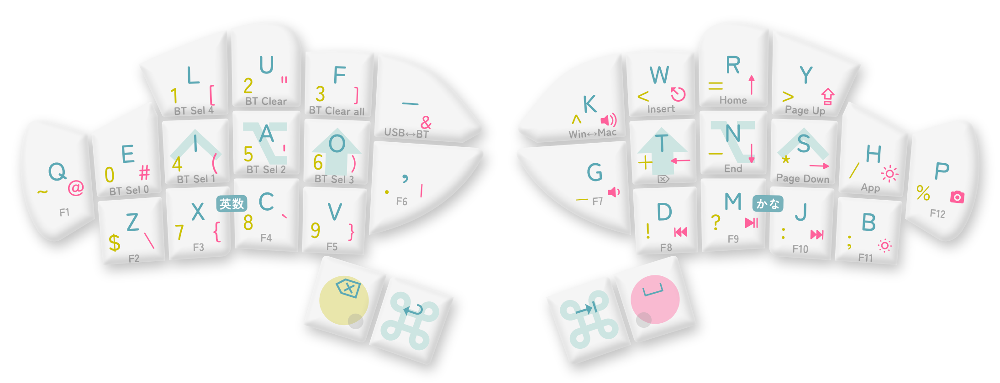

# Fish

## Description
The Fish keyboard is a 32-key split ergonomic wireless keyboard based on ZMK. The bottom plate is machined from brass, with the top housing and keycaps being 3D printed.

The official website for the keyboard can be found [here](https://o24.works/fish/)

A typing test was found on YouTube [here](https://www.youtube.com/watch?v=iKSnUOVDimM&t=841s) showcasing usage of the design.

## Layout

## Designer
- Takuma Onishi (大西 拓磨)

## Group Buy Information
- Purchase is available on Yushakobo within Japan: https://shop.yushakobo.jp/en/products/9519
- Price: ¥39,700 / $252
- Planned to be sold at the Tokyo Market in March of 2025.
