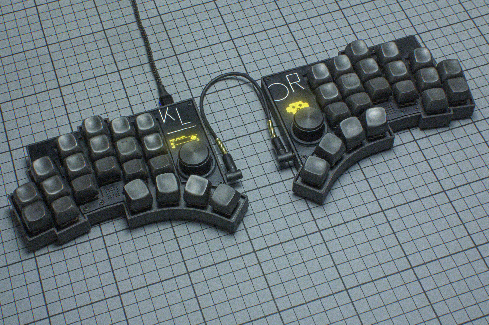
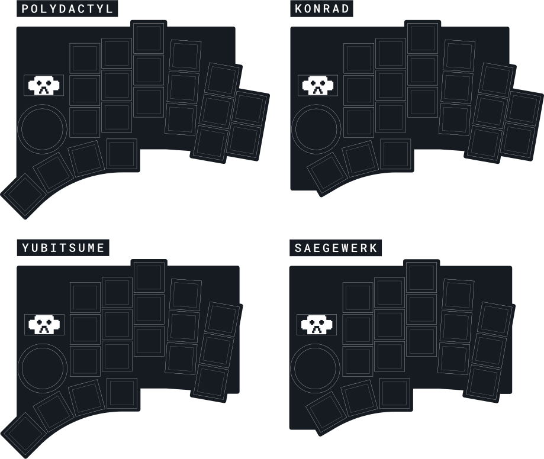

# Klor

## Description
KLOR is a 36-42 key column-staggered split keyboard. It supports a per-key RGB matrix, encoders, OLED displays, haptic feedback, speakers, a Pixart Paw3204 trackball, the SplitKB tenting puck, and four different layouts, through break-off parts.

## Layout

## Designer
- [Geist](https://github.com/GEIGEIGEIST)

## Group Buy
No group buy was held for this keyboard.
