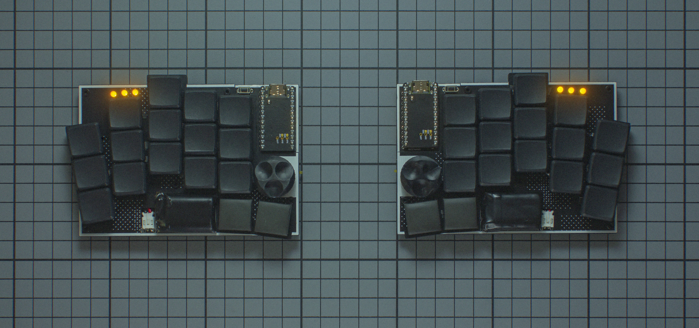
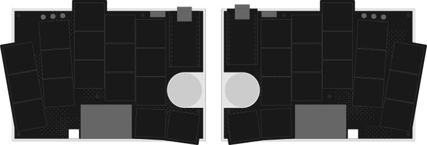

# Klotz

## Description
KLOTZ is a 34 key column-staggered choc split keyboard running ZMK. It supports a low profile encoder, three status LEDs on every side and the SplitKB tenting puck.

## Layout

## Designer
- [Geist](https://github.com/GEIGEIGEIST)

## Group Buy Information
- No group buy was held for this keyboard. 
