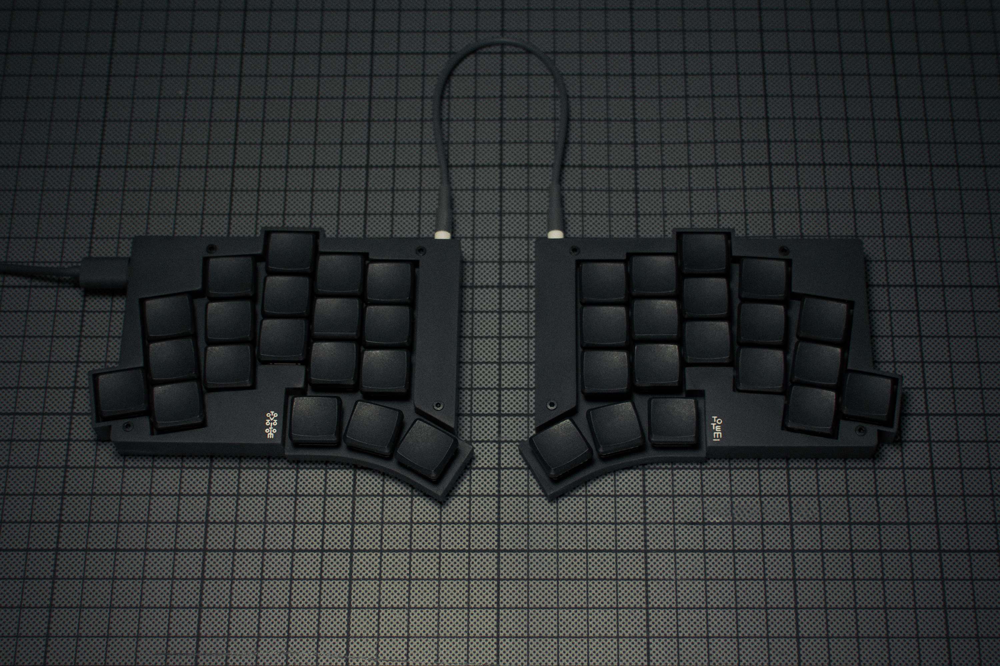

# Totem

## Description
TOTEM is a 38 key column-staggered choc split keyboard with splay. It was created for the SEEED XIAO keyboard contest.

TOTEM is open-source and [available here.](https://github.com/GEIGEIGEIST/TOTEM/tree/main)

## Layout

## Designer
-- [Geist](https://github.com/GEIGEIGEIST)

## Group Buy
No group buy was held for this keyboard.
