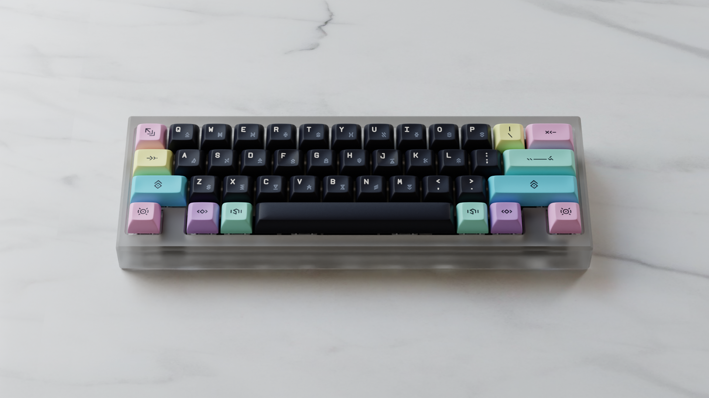
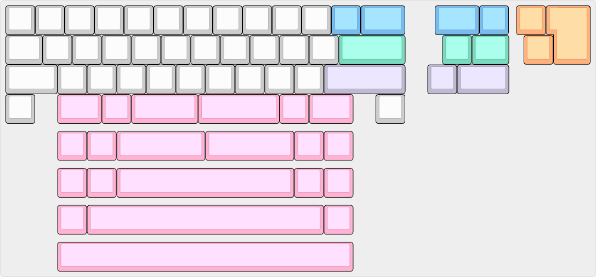

# Ampersand

*Image provided by [Alas](https://www.cbkbd.com/).*

## Description
Ampersand is a gummyworm mounted 13.5u keyboard with only minimal 40s support required.

In November, 2024; Keeb.Supply released a concrete version of the case available [here](https://keeb.supply/products/amperconcrete), canonically named "Amperconcrete".

## Layout

## Designer
- WhiteFaceMountain

## Group Buy Information
- US Vendor: [Coffee Break Keyboards](https://cbkbd.com)
- EU Vendor: [KeebSupply](https://keeb.supply)
- Date: November 29 to December 29, 2023
- Price: US$250 / €250
