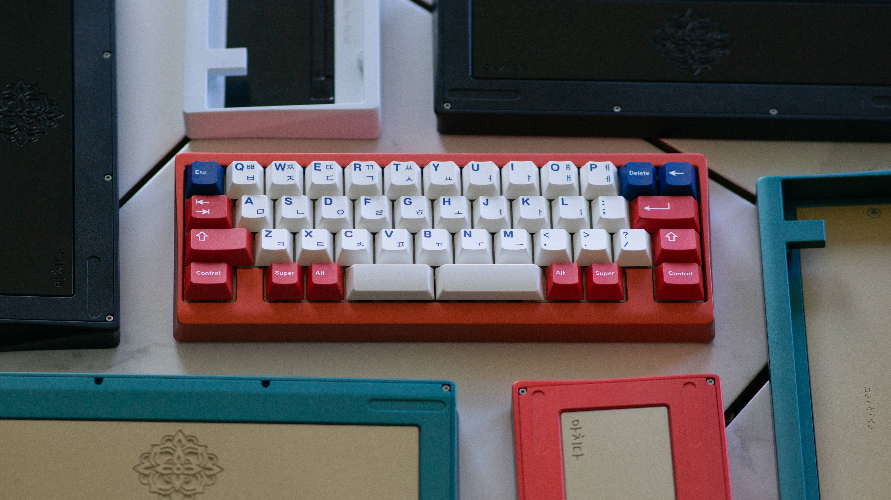
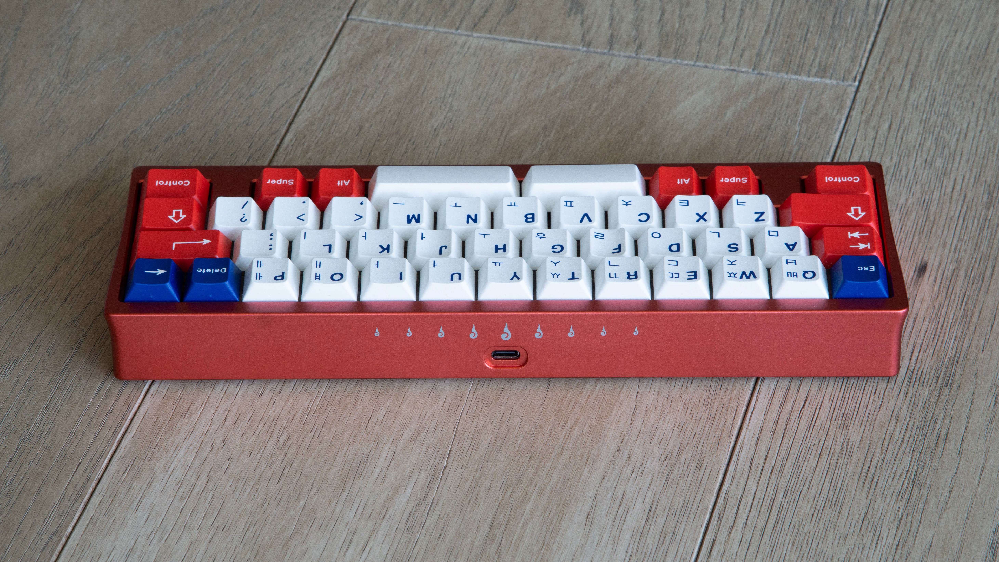

# Machida

## Description
Machida is a 13u WKL/HHKB O-Ring/Gasket top mount keyboard designed by FruityKeeb. Machida utilizes an o-ring bottom + gasket top mount construction.

Inspired from the traditional Korean Dancheong Artwork, the weight features an engraving of the Morucho pattern with the Hangul name, 마치다, in the left corner. The rear laser etched clouds are inspired from South Korean Tattoo Artist, PittaKKM.

## Layout

## Designer
- [FruityKeeb](https://fruitykeeb.xyz/)

## Group Buy Information
- Dates: March 11th - April 2rd 2023
- Price: $380 - $390
- Extras were made available on September 27th 2024
