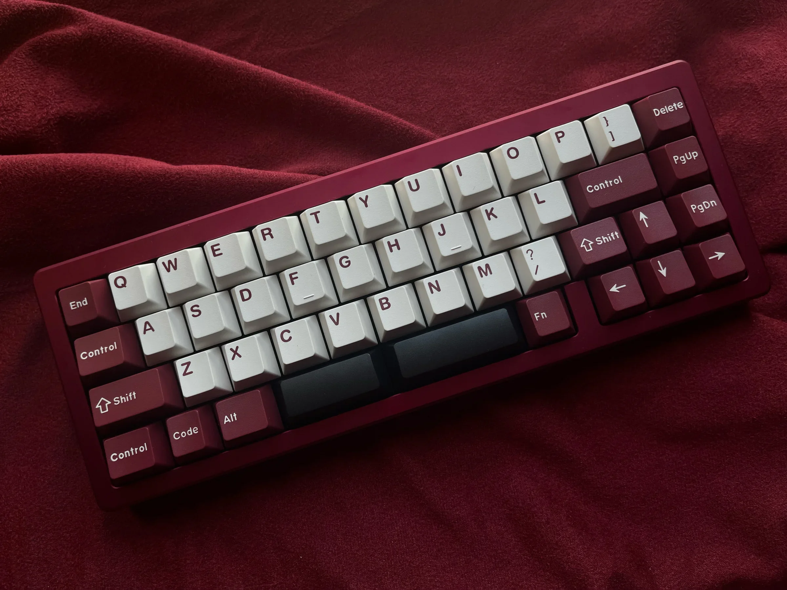
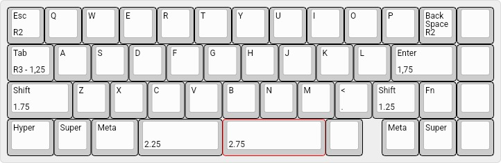

# S46

## Description
The S46 is a 13u keyboard with a dedicated arrow cluster and blocker designed typically seen on 65%+ boards.

## Layout

## Designer
- [NotFromSam](https://notfromsam.com/)

## Group Buy Information
R1 Date: May 18th - June 1st, 2022
R1 Price: $169 - $189

R2 Date: July 30th - August 22nd, 2024
R2 Price: $189 - $209
