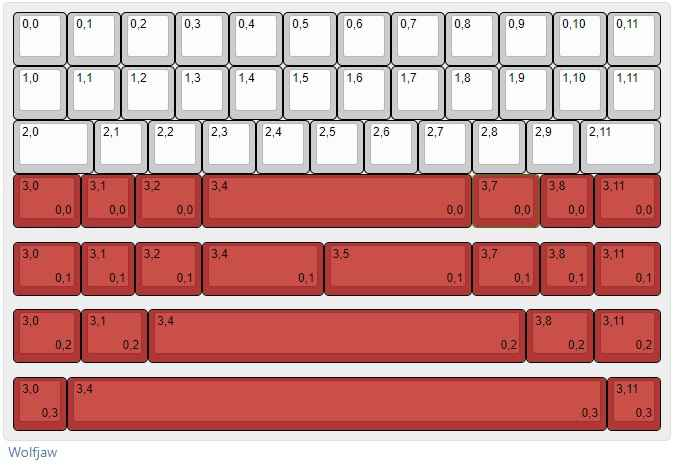

# Wolfjaw
//todo cover image

## Description
Wolfjaw is a 12u Alpha stagger keyboard based around a the proportions and symmetry of the Tsangan layout, in a 40% form factor. Wolfjaw is o-ring mounted, and has support for a 5u spacebar.

## Layout

## Designer
- WhiteFaceMountain

## Group Buy Information
- A private group buy was held in June 2024. 4 aluminum and 1 polycarbonate unit were made.
- TBD on public  
